# Uncapped — Competitor Analysis
**Last updated:** 2026-04-28
**Sources:** Internal competitive brief (April 2026) · extended web research · offer UX benchmark study (local) · [Figma benchmark board](https://www.figma.com/design/9VEkjGMBgUoiZxYAtDmqhi/Untitled?node-id=0-1)
**Scope:** E-commerce lending — US and UK markets

---

## Market Overview

The e-commerce working capital market is forecast to reach **$14.4B by 2030 (25.4% CAGR)**. It splits into two acquisition models:

| Model | Description | Players |
|---|---|---|
| **Direct-to-merchant** | Brand/content-led acquisition, direct relationship | Wayflyer, Clearco, Iwoca |
| **Embedded/platform** | Merchants reached through integrations inside existing platforms | Slope, Parafin, Shopify Capital, Amazon Lending |

Uncapped competes on **both fronts** — direct brand plus partnerships API.

---

## Competitor Map

```
                  HIGH BRAND AWARENESS
                          │
           Wayflyer ──────┼──── Clearco
                          │
EMBEDDED ─────────────────┼──────────────────── DIRECT
                          │
        Parafin    Slope  │         Iwoca
  Shopify Capital         │
                          │
                  LOW BRAND AWARENESS
```

---

## Primary Competitors

---

### 1. Wayflyer

**Headquarters:** Dublin, Ireland
**Founded:** 2019
**Stage:** Growth — €95.2M revenue FY2024 (50% YoY), €48M net loss
**Total funded:** $6B+ across 6,000+ businesses
**Trustpilot:** 4.9/5 · 92% five-star

#### Positioning
> *"Apply in minutes. Access capital in hours."*

Wayflyer leads on **speed and trust**. Their brand is built around three pillars:
- Hassle-free (funds in 24 hours)
- Limited risk (no personal guarantees, no equity)
- No spend restrictions (direct bank deposit)

They target DTC founders with $20K+/month revenue in the $5K–$20M funding range.

#### Products
| Product | Details |
|---|---|
| Cash Advance | Revenue-based, 5–10% fixed fee |
| Term Loan | Fixed term, fixed fee |
| Rolling Finance | Revolving access as repayments are made |
| Wholesale Financing | For inventory/supplier payments (offline brands) |
| Hosted Capital | Platform tool for brand partners |

#### Pricing
- **5–10% fixed fee** — no compounding interest, no hidden costs
- Repayment aligned to sales cycles (% of daily revenue)
- Minimum: $20K/month revenue

#### Key Stats (FY2024)
- €95.2M revenue (+50% YoY)
- €48M net loss (widening — profitability path is a question)
- $250M new debt facility (ATLAS SP Partners, Feb 2026)
- $1.6B valuation

#### Strengths
- Best Trustpilot in category (4.9/5, 92% five-star)
- Institutional backing ($250M + historic J.P. Morgan + Credit Suisse)
- Strong integration ecosystem: Amazon, Shopify, BigCommerce, Google Ads, Facebook Ads, Triple Whale
- Execution excellence: fast, simple, reliable
- "Hosted Capital" product opens B2B2C channel

#### Weaknesses
- Underwriting opacity — 6% of reviewers cite poor explanations for declines/offers
- Widening losses (€48M loss on €95.2M revenue)
- US-only for $20M cap; UK presence smaller than US
- No line of credit product (one-shot drawdowns only)

#### UI / UX Analysis

**Figma benchmark:** [Wayflyer section](https://www.figma.com/design/9VEkjGMBgUoiZxYAtDmqhi/Untitled?node-id=1-3)

**Website:**
- Clean hero with two bold CTAs ("Get started" / "Talk to sales")
- 3-step "How it works" reducing perceived complexity
- Funding calculator showing 1.5–3× monthly revenue range
- Multiple social proof layers: logo wall, Trustpilot score, customer quotes

**Application flow (3 steps, ~12 min):**
1. Share business details (~2 min)
2. Connect sales platforms (Amazon, Shopify, etc.) for read-only data (~10 min)
3. Review offer → accept → funds within 24h

---

**Screen 1 — Merchant Dashboard (Home)**


*[View in Figma](https://www.figma.com/design/9VEkjGMBgUoiZxYAtDmqhi/Untitled?node-id=1-8)*

This is Wayflyer's biggest UX differentiator: the dashboard is a **full merchant analytics platform**, not a loan tracker.

- Left sidebar: Wayflyer teal logo, account switcher ("Manage Harver"), icon+label nav (Home, Notifications, Cards, Payments, Insights, Freight), then an "APPS" section with integrated tools (Sales Expert, Newsstand, Chartly, Golden Bar)
- "Add Widget" button top-right — modular, customisable dashboard
- **Revenue Rate chart:** full-width purple bar chart for Jan–Dec, with the current month highlighted and annotated ($4,678). Soft purple is warm and non-threatening
- **Insight card (green):** `+78% increase in your revenue by end of this month is forecasted` — bold white text on rich green (#00A86B range). This is emotionally positive reinforcement, not just data reporting. The card is the visual anchor of the entire dashboard
- **Sales Expert widget:** channel breakdown — Instagram ($10,065.23 +87.2%), Shopify ($5,721.63 +21.7%), Facebook ($1,268.18 -1.9%). Colour-coded deltas (green up, red down)
- **Facebook Best Seller widget:** product image (orange bag), purchase count, likes — social commerce data embedded
- **Conversion Rate widget:** amber/yellow, 28.52%, with Visits and Add to Cart deltas

Key design observations:
- White background, card-grid layout — very clean and breathable
- Each widget has an independent "..." overflow menu for management
- Colour coding is semantic: green = positive insight, purple = revenue data, amber = conversion metrics
- This is a **Wayflyer-specific differentiator** — no other lender in the category gives merchants marketing analytics inside their capital dashboard

---

**Screen 2 — Mobile Dashboard**

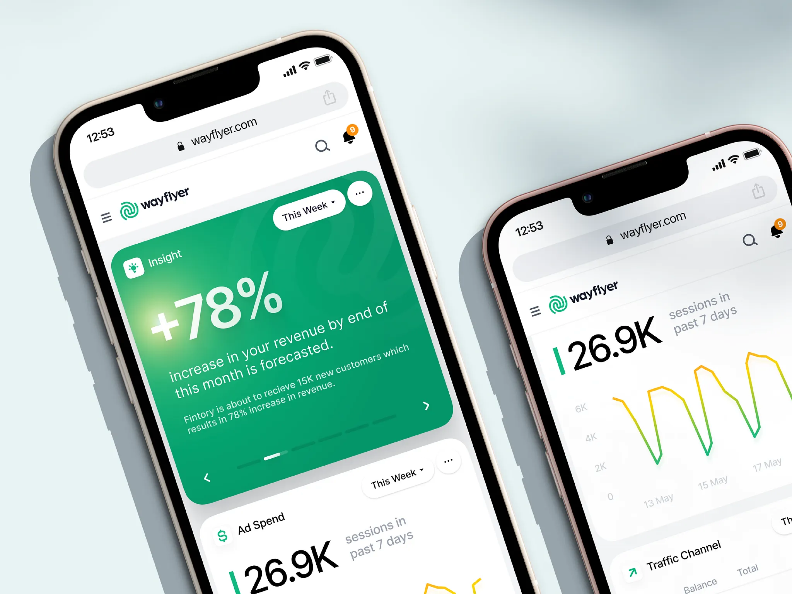
*[View in Figma](https://www.figma.com/design/9VEkjGMBgUoiZxYAtDmqhi/Untitled?node-id=1-11)*

- Two iPhones side by side (marketing visual, not a prototype)
- Left phone: green insight card dominant above fold (`+78%` in very large type), then "Ad Spend" section below, 26.9K sessions metric
- Right phone: 26.9K sessions in past 7 days with yellow/green multi-line chart ("Traffic Channel" — Balance + Total)
- "This Week ▾" period picker — same data range controls as desktop
- Mobile experience is card-first: the insight card fills the full viewport width, one card at a time

---

**Screen 3 — Offer Screen**

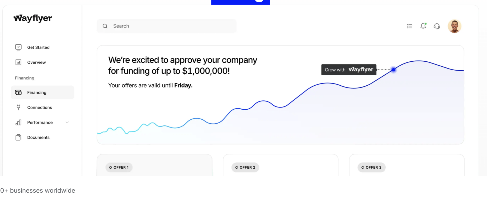
*[View in Figma](https://www.figma.com/design/9VEkjGMBgUoiZxYAtDmqhi/Untitled?node-id=1-14)*

- Full nav visible: Get Started, Overview, Financing (active), Connections, Performance, Documents — a proper product with depth
- Celebration copy: **"We're excited to approve your company for funding of up to $1,000,000!"** — personal, enthusiastic
- Urgency trigger: "Your offers are valid until **Friday**." — deadline in bold
- Background: smooth blue-to-light gradient line chart (aspirational/growth imagery, not real data)
- Below: three offer tiles labelled OFFER 1 / OFFER 2 / OFFER 3 — merchant gets to choose their preferred structure, not presented a single take-it-or-leave-it number

Design notes:
- Offer presentation is a celebration, not a form
- Multiple offers side-by-side signals flexibility and respect for the merchant's preference
- Urgency is embedded as product copy, not as a banner or pop-up

---

**UX patterns to study:**
- Modular dashboard ("Add Widget") — gives merchants agency over their data view
- Integrated apps model: third-party data sources shown as "apps" in sidebar, not hidden in settings
- Green insight card as emotional anchor — leading with forward-looking positive forecast, not past data
- Multi-offer comparison at acceptance stage — OFFER 1/2/3 instead of single offer

---

### 2. Slope

**Headquarters:** San Francisco, CA
**Founded:** 2021
**Stage:** Series A+ — $252M raised ($77M equity + $175M J.P. Morgan debt)
**Geography:** US only (no international announced)

#### Positioning
> *"Credit infrastructure for business lending"*

Slope is **B2B infrastructure**, not a direct lender brand. They power Amazon seller financing, Walmart, Alibaba, IKEA, and Samsung with embedded credit inside those platforms. Merchants may never know Slope is the provider.

#### Products
| Product | Details |
|---|---|
| Amazon Seller Line of Credit | Up to $5M at 8.99% APR, backed by J.P. Morgan |
| Embedded Capital | White-label credit for platforms (Walmart, Alibaba, IKEA) |
| SlopeScore | Proprietary AI underwriting engine — "99% accuracy" claim |

#### Pricing
- Amazon Seller LoC: **8.99% APR** (highly competitive against MCAs at 30%+ effective APR)
- Other products: not publicly disclosed

#### Strengths
- First-click capital inside Amazon Seller Central — merchants never need to leave
- SlopeScore AI underwriting with claimed 99% accuracy
- J.P. Morgan backing gives institutional credibility
- Platform partnerships create locked-in distribution

#### Weaknesses
- US only — no UK or EU presence
- $100K+ annual revenue threshold excludes newer/smaller sellers
- Zero direct brand recognition with merchants
- Platform concentration risk (heavily dependent on Amazon/Walmart relationships)

#### UI / UX Analysis

**Product surface:** Slope has no merchant-facing branded app. Their UX lives entirely inside partner platforms.

**Amazon integration UX pattern:**
- Offer widget appears inside Seller Central with pre-approved limit
- Single-click accept (no separate application form if data already shared)
- Repayment automatically deducted from Amazon disbursements

**Partner dashboard (for platforms, not merchants):**
- Data visualisation focus: loan book performance, approval rates, volume
- API-first design — most configuration done through developer console

**UX lesson for Uncapped:**
- Embedded, zero-friction acceptance is the highest-converting UX
- Pre-approved offers eliminate the "application anxiety" step
- The competitive threat is not UX — it's distribution lock-in

> No Slope screens in the benchmark study. Their product is not publicly accessible.

---

### 3. Parafin

**Headquarters:** San Francisco, CA
**Founded:** 2020
**Stage:** Late growth — $190M equity + $360M forward-flow (Sept 2025)
**Scale:** $25B+ cumulative capital offers to hundreds of thousands of merchants
**Approaching profitability**

#### Positioning
> *"A financing program, built for your platform"*

Parafin is the **white-label infrastructure layer** powering Amazon Capital, Walmart Marketplace Capital, DoorDash Capital, and 100+ other platforms. They have zero direct brand recognition — every touchpoint is white-labeled.

#### Products
| Product | Details |
|---|---|
| Capital by Parafin | White-label MCA — the core embedded product |
| Spend Card | Business debit/spend card for merchants |
| Pay Over Time | BNPL for B2B purchases |

#### Key Stats
- $25B+ in cumulative offers
- 400% YoY volume growth
- 100+ platform partners
- Total capitalization: $643M+

#### Strengths
- Powers Amazon Capital (largest e-commerce ecosystem in the world)
- Wallet-share advantage: offers appear inside merchants' existing work tools
- Pre-approved model — no application required, merchant just accepts
- Scale moat: volume and data create better underwriting over time

#### Weaknesses
- No direct brand — can't build customer loyalty or retention independently
- Platform concentration creates existential partnership risk
- Merchant experience fully controlled by the platform partner, not Parafin
- If Amazon/Walmart builds in-house, Parafin loses that channel

#### UI / UX Analysis

**Figma benchmark:** [Parafin section](https://www.figma.com/design/9VEkjGMBgUoiZxYAtDmqhi/Untitled?node-id=2-2)

**Merchant-facing UX:** Entirely white-labeled — no Parafin branding visible.

**Dashboard widget model (from docs):**
- Offer appears as a widget in the platform's merchant dashboard
- Merchant selects amount from a slider (within pre-approved range)
- Sees breakdown: amount, fee, repayment schedule
- Submits personal + business + bank verification
- Funds disbursed, repayment via automated % of platform revenue

---

**Screen 1 — Partner Analytics Dashboard**

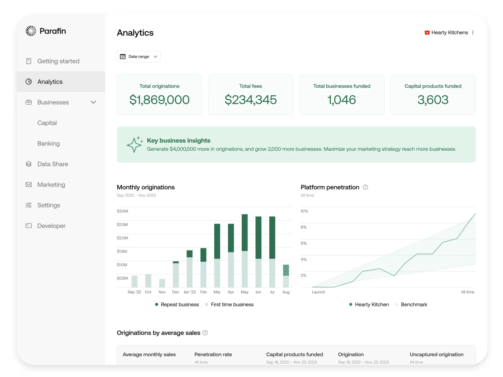
*[View in Figma](https://www.figma.com/design/9VEkjGMBgUoiZxYAtDmqhi/Untitled?node-id=2-4)*

This is Parafin's dashboard for **platform operators** (e.g. Walmart, DoorDash) — not for merchants. It shows the lender's loan book performance for that platform.

- Left sidebar: Parafin logo (dark), Getting started, **Analytics** (active), Businesses (Capital, Banking), Data Share, Marketing, Settings, Developer — "Developer" in the nav immediately signals B2B infrastructure product
- **Context selector:** "Hearty Kitchens :" top right — operator can filter by their platform/merchant
- **KPI row (4 metrics):** Total originations $1,869,000 · Total fees $234,345 · Total businesses funded 1,046 · Capital products funded 3,603. All in green/teal numerics with muted labels
- **"Key business insights" banner:** green, star icon, AI-generated recommendation: "Generate $4,000,000 more in originations, and grow 2,000 more businesses. Maximize your marketing strategy…" — proactive intelligence surface
- **Monthly originations:** stacked bar chart (dark green = repeat business, light green = first-time). Shows consistent growth Sep 2022–Nov 2023
- **Platform penetration:** smooth area line chart with benchmark comparison line — shows operator's penetration rate vs benchmark over time

Design notes:
- White background, green accent system — clean and professional
- Two-column chart layout makes good use of horizontal space
- The "Key insights" AI banner positioned between KPIs and charts is a strong pattern — actionable intelligence between data and context
- Very different visual register from Wayflyer — quieter, more data-dense, B2B feel

---

**Screen 2 — Website / Merchant Offer Widget**

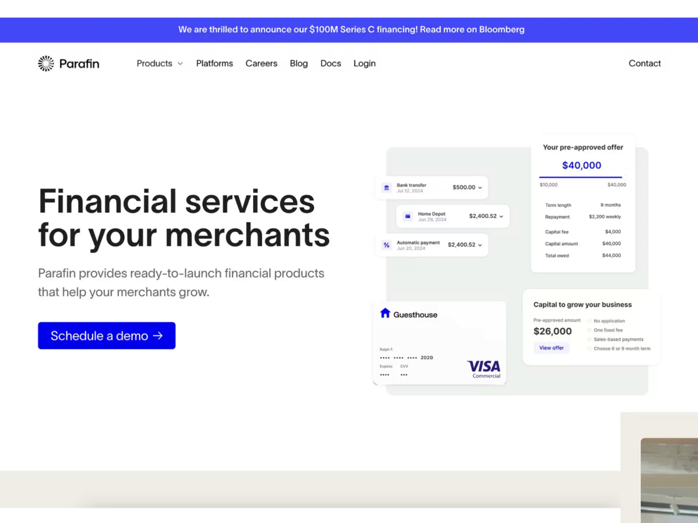
*[View in Figma](https://www.figma.com/design/9VEkjGMBgUoiZxYAtDmqhi/Untitled?node-id=2-9)*

This is the Parafin.com homepage — targeting platform operators, not merchants.

- Blue announcement banner: "$100M Series C financing" — builds credibility for operator prospects
- Nav: Products, Platforms, Careers, Blog, Docs, Login — "Docs" in nav signals developer-first
- Hero copy: **"Financial services for your merchants"** / "Parafin provides ready-to-launch financial products that help your merchants grow."
- CTA: "Schedule a demo →" — enterprise/B2B sales motion only, no self-serve signup

The hero UI shows how the merchant experience actually looks inside a partner platform:

**Pre-approved offer card anatomy (right side of hero):**
```
Your pre-approved offer
$40,000                    [────────────────●] $10,000 → $40,000

Term length        9 months
Repayment          $2,200 weekly
Capital fee        $4,000
Capital amount     $40,000
Total owed         $44,000
```
- Amount shown as the dominant number in blue
- Slider for amount selection with min/max range visible
- Full fee breakdown below — transparent and structured
- No CTA shown — this is embedded inside a partner's flow

**"Capital to grow your business" widget (smaller):**
```
Pre-approved amount    $26,000
                       No application
                       One fixed fee
                       Sales-based payments
                       Choose 6 or 9 month term

[View offer]
```
- Pre-approval surfaced without any application step
- Three value props listed as simple text bullets
- "View offer" as the only action — low pressure

**Design references:**
- [Parafin brand refresh article](https://www.parafin.com/blog/designing-for-growth-inside-parafins-brand-refresh)
- [Parafin dashboard (live)](https://dashboard.parafin.com/)

**Screen 3 — Offer Acceptance / Contract Review**

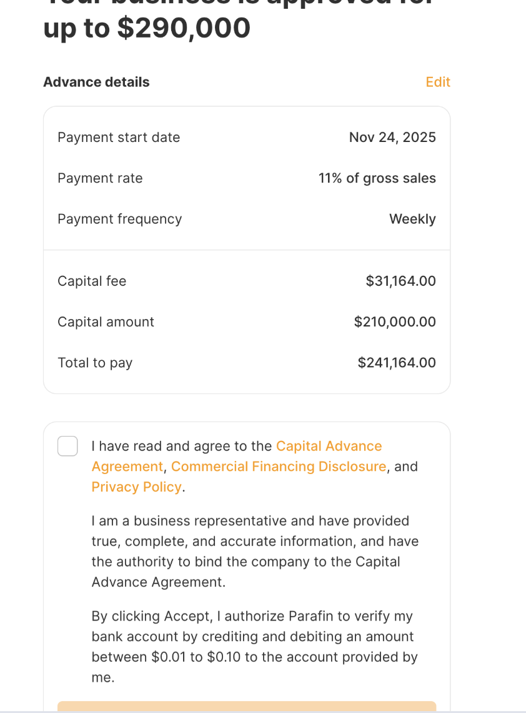

"Your business is approved for up to $290,000." Advance details table: Payment start date Nov 24 2025 · Payment rate 11% of gross sales · Payment frequency Weekly · Capital fee $31,164 · Capital amount $210,000 · Total to pay $241,164. Below: checkbox for T&Cs with legal text. "By clicking Accept, I authorize Parafin to verify my bank account by crediting and debiting an amount between $0.01 to $0.10." This is the merchant-facing acceptance screen inside a platform (white-labeled). The offer is already accepted — this is the confirmation/signature step.

Design observations:
- All fees shown before acceptance: capital fee + total to pay are explicit — no surprises
- "Edit" link in the header means merchant can go back and adjust the amount
- Bank micro-deposit verification is old-school but legally required — framed as a simple sentence, not a blocker
- Very minimal — just the table, the legal checkbox, and the CTA. No persuasion elements needed at this stage

**UX lessons for Uncapped:**
- Pre-approved offer = zero application anxiety; amount slider with min/max sets expectations before merchant commits
- Full fee transparency (fee + total owed shown explicitly) is a trust signal — not just "from X%"
- The AI insights banner pattern (between KPIs and charts) is worth borrowing for Uncapped's dashboard
- "No application · One fixed fee · Sales-based payments" as three copy bullets is a strong pattern for embedded context where screen space is limited

---

### 4. Clearco

**Headquarters:** Toronto, Canada (formerly Clearbanc)
**Founded:** 2015
**Stage:** Restructured Oct 2023, relaunched late 2025
**Total funded:** $3B+ across 10,000+ brands

#### Positioning
> *"Flexible Funding for Strategic Founders & Operators"*

Clearco is DTC-first, targeting brands with $100K+ monthly revenue. After a difficult 2022–2023 (restructuring, layoffs), they relaunched with a cleaner three-product suite and tighter qualification criteria.

#### Products
| Product | Details |
|---|---|
| Fixed Funding Capacity | One-time capital, predictable repayment; 6–12.5% fee |
| Rolling Funding Capacity | Auto-replenishing as repayments are made |
| Invoice Funding | Pay suppliers directly; ~5% fee for 4 months |
| Cash Advance | Flexible bank deposit for multi-use |

**Key differentiator:** Revenue protection — repayment never exceeds 30% of weekly revenue.

#### Pricing
- Cash Advance: **6–12.5% fee**
- Invoice Funding: **~5% for 4 months**
- Minimum: $100K/month revenue, 12+ months consistent history, US incorporation

#### Strengths
- Dual funding model (Fixed + Rolling) is flexible and merchant-friendly
- Revenue cap (30% debit) prevents cash-flow distress
- 10,000+ funded brands — large portfolio signals market validation
- Non-dilutive, no personal guarantees, no collateral

#### Weaknesses
- Restructuring history undermines trust (mentioned in reviews)
- DTC-only positioning limits Amazon marketplace seller reach
- Qualification bar ($100K/month) excludes mid-market
- US-only (Canada incorporated but US-focused)

#### UI / UX Analysis

**Website (clear.co):**
- Bold hero: "Flexible Funding for Strategic Founders & Operators"
- 4 trust anchors above fold: 24h funding, no collateral, capped payments, no personal guarantee
- Social proof: 10,000+ brands, $3B+ deployed, recognizable DTC logos (Magic Spoon, Monos, Tushy)
- Simple 4-step application flow shown visually: Connect → Choose Structure → Review → Deploy
- "Get Funded" primary CTA repeated throughout

**Application flow (4 steps):**
1. **Connect & Share** — Link sales + bank accounts (Shopify, Amazon, Stripe, PayPal)
2. **Choose Structure** — Fixed vs Rolling funding mode selection
3. **Review** — 24h approval window
4. **Deploy** — Cash Advance or Invoice Funding mode

**UX patterns to study:**
- Funding structure choice as a core UX decision (not just amount)
- Invoice Funding as a separate flow to supplier payment (not standard in category)
- Revenue-capped repayment as a trust-building UX element

---

**Screen 1 — Offer Selection (pre-2023 model)**

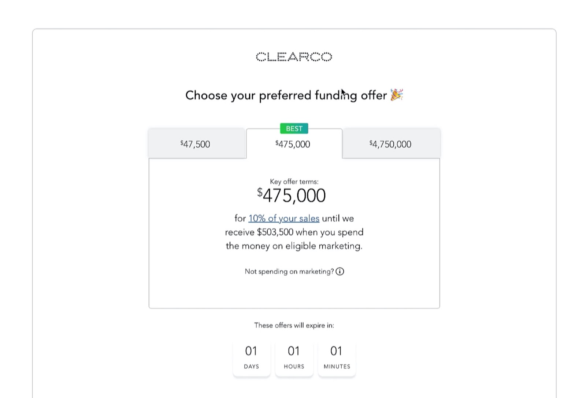

"Choose your preferred funding offer 🎉" — three amount tabs: $47,500 · **$475,000** (labelled "BEST" in green) · $4,750,000. Selected tab shows key terms: "$475,000 for **10% of your sales** until we receive $503,500 when you spend the money on eligible marketing." Link: "Not spending on marketing? ⓘ" Countdown: "These offers will expire in: 01 DAYS 01 HOURS 01 MINUTES."

> Note: This screen is from Clearco's pre-2023 product (capital tied specifically to marketing spend). Current product (post-2025 relaunch) is general-purpose with no marketing requirement.

Design observations:
- Three amount tiers with "BEST" badge anchors the middle option — a classic Goldilocks pricing pattern
- Total to repay stated plainly in the copy ("receive $503,500") rather than as a fee percentage — rare transparency
- Countdown timer is the most aggressive urgency mechanic in the category — 01 DAYS 01 HOURS 01 MINUTES
- Party emoji in the headline sets a celebratory, founder-friendly tone at the moment of offer

---

**Screen 2 — ClearAngel Dashboard (powered by Clearco)**

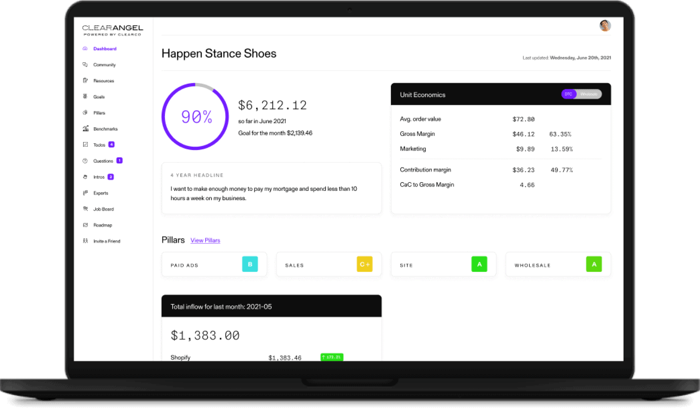
*[View in Figma](https://www.figma.com/design/9VEkjGMBgUoiZxYAtDmqhi/Untitled?node-id=4-34)*

ClearAngel is Clearco's merchant operating system — positioned beyond lending into business coaching. This is the deepest dashboard in the category.

- Branding: "CLEARANGEL POWERED BY CLEARCO" — co-branding suggests this is a separate product/tier
- Background: very dark navy/charcoal (unique in the category — everyone else is white)
- Left sidebar: 13+ items — Dashboard, Community, Resources, Goals, Pillars, Benchmarks, Todos, Questions, Intros, Experts, Job Board, Roadmap, Invite a Friend — this is a full merchant growth platform, not a loan product

**Main content panel (merchant: "Happen Stance Shoes"):**
- **Circular progress indicator:** 90% with `$6,212.12 so far in June 2021. Goal for the month $2,139.46` — goal-based framing, not loan-balance framing
- **"4 Year Headline" field:** merchant writes their own goal: *"I want to make enough money to pay my mortgage and spend less than 10 hours a week on my business."* — qualitative, personal, coaching-style
- **Unit Economics panel** (right side, dark card): structured financial data — Avg order value $72.80, Gross Margin $46.12 (63.35%), Marketing $9.89 (13.59%), Contribution margin $36.23 (49.77%), CaC to Gross Margin 4.66
- **Pillars** (performance grade scoring): PAID ADS → B, SALES → C+, SITE → A, WHOLESALE → A — coloured letter grades (teal, yellow, green) provide instant health signal
- **Total inflow for last month: 2021-05:** $1,383.00 from Shopify ($1,383.46)

Design observations:
- The darkest UI in the category — creates a "serious tool for serious operators" feeling
- Letter grade scoring system is immediately scannable (no charts needed to know where to focus)
- Combining financial data + personal goals + performance grades = full-stack business intelligence, far beyond any other lender's dashboard
- Risk: very high information density; not appropriate for first-time borrowers or smaller merchants
- This is a retention/loyalty tool, not an acquisition tool — it keeps merchants inside Clearco's ecosystem long-term

---

## Adjacent / Embedded Competitors

---

### 5. Shopify Capital

**Model:** MCA + Loan embedded in Shopify admin
**Geography:** US, UK, Canada, Australia, Ireland
**Scale:** $4.2B deployed FY2025

**Pricing:** Factor rate 1.10–1.17 (equivalent to 10–60%+ APR depending on repayment speed)

**Screen 1 — Offer Selection (Monthly-fee tab)**

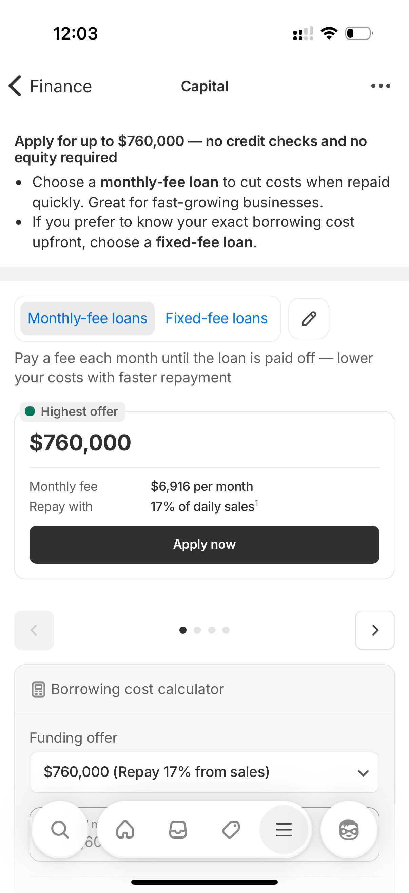

Mobile (Shopify app). Finance › Capital. "Apply for up to $760,000 — no credit checks and no equity required." Two tabs: **Monthly-fee loans** (selected) / **Fixed-fee loans**. Highest offer: **$760,000**, monthly fee $6,916/month, repay with 17% of daily sales. "Apply now" button (black, full-width). Borrowing cost calculator below with a funding offer dropdown pre-populated with the offer amount.

**Screen 2 — Offer Selection (Fixed-fee tab)**

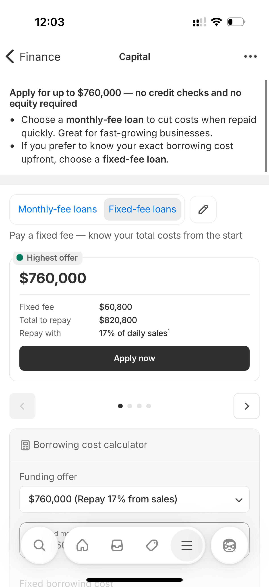

Same screen, Fixed-fee loans tab active. Highest offer: **$760,000**, fixed fee $60,800, total to repay $820,800, repay with 17% of daily sales. The tab switch instantly updates all numbers — the fee structure is the only variable changing.

**Screen 3 — Revenue Data Used for Underwriting**

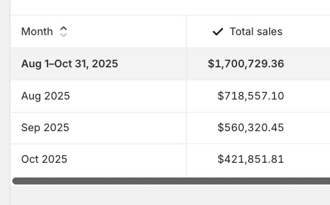

A sales breakdown table shown during the eligibility/underwriting phase. Total sales Aug 1–Oct 31, 2025: $1,700,729.36. Monthly breakdown: Aug $718,557.10 · Sep $560,320.45 · Oct $421,851.81. This data is pulled directly from Shopify — no manual input. Shown to the merchant so they can see exactly what data is informing their offer.

Design observations:
- Two loan types surfaced as tabs at the offer step — forces a choice but also educates on the tradeoff
- Borrowing cost calculator embedded directly below the offer (not a separate page) — reduces decision anxiety
- Revenue table transparency: showing merchants the exact data used to calculate their offer is an uncommon trust signal
- Fully embedded in the Shopify mobile app — no separate app, no separate login

**Strength vs Uncapped:** Merchants already trust and live inside Shopify admin. Zero friction.
**Weakness:** Locked to Shopify merchants only. No multi-platform sellers.

---

### 6. Iwoca (UK)

**Model:** Unsecured term loan, FCA-regulated
**Geography:** UK only
**Scale:** £730M lent 2024; profitable since 2022

**Pricing:** Not publicly disclosed (FCA-regulated, customised offers)

**Products:**
- Flexi-Loan: £1K–£1M, 3–24 months
- iwocaPay: B2B BNPL for trade purchases

**Application flow:**
- 5-minute online form
- Decision within 24–48 hours
- Open banking integration for trading history

**Figma benchmark:** [Iwoca section](https://www.figma.com/design/9VEkjGMBgUoiZxYAtDmqhi/Untitled?node-id=3-21)

---

**Screen 1 — Eligibility Confirmation**

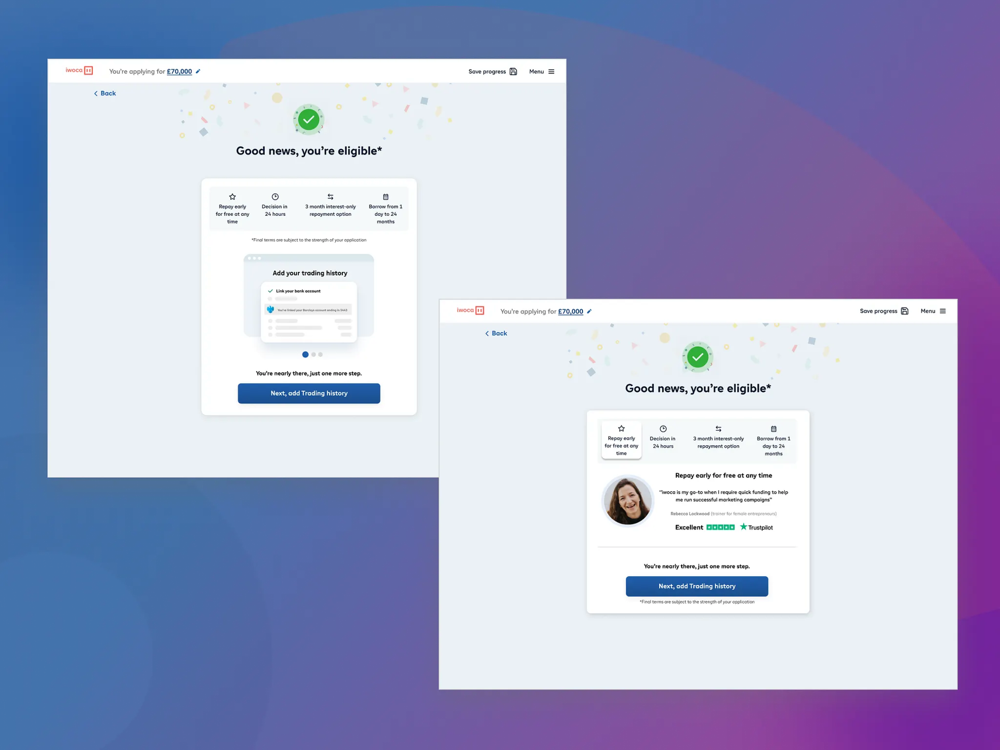
*[View in Figma](https://www.figma.com/design/9VEkjGMBgUoiZxYAtDmqhi/Untitled?node-id=3-22)*

Two overlapping browser windows showing the same step with two content variants (A/B or responsive breakpoint).

- Background: rich purple-to-pink gradient — warm, distinctly consumer-friendly vs every competitor's clinical white
- Persistent header: "iwoca" logo + **"You're applying for £70,000" (editable with pencil icon)** + "Save progress 💾" + "Menu ≡" — the loan amount stays visible throughout the journey and is editable at any point
- **"Good news, you're eligible\*"** headline with large green checkmark and confetti particles — genuine celebration moment
- 4 benefit icons in a row: Repay early for free at any time · Decision in 24 hours · 3 month interest-only repayment option · Borrow from 1 day to 24 months
- **Variant 1 (desktop):** Shows "Add your trading history" sub-step — a mini UI preview of the bank connection step (open banking account linking), then "You're nearly there, just one more step." → "Next, add Trading history" (blue CTA)
- **Variant 2 (mobile/smaller):** Same eligibility confirmation but swaps the sub-step preview for a **customer testimonial** — real photo, Rebecca Lockwood quote, Trustpilot "Excellent" badge inside the card

Design observations:
- Editable amount in the persistent header is a high-trust signal — merchant knows they haven't been locked into a number
- The confetti celebration is one of the warmest moments in the category — emotional contrast to the dry financial process before it
- Showing two content variants in the same step (progress cue vs social proof) suggests they A/B test the eligibility confirmation screen
- Purple/pink background immediately differentiates from every white-screen competitor

---

**Screen 2 — Final Application Step (Add Trading History)**

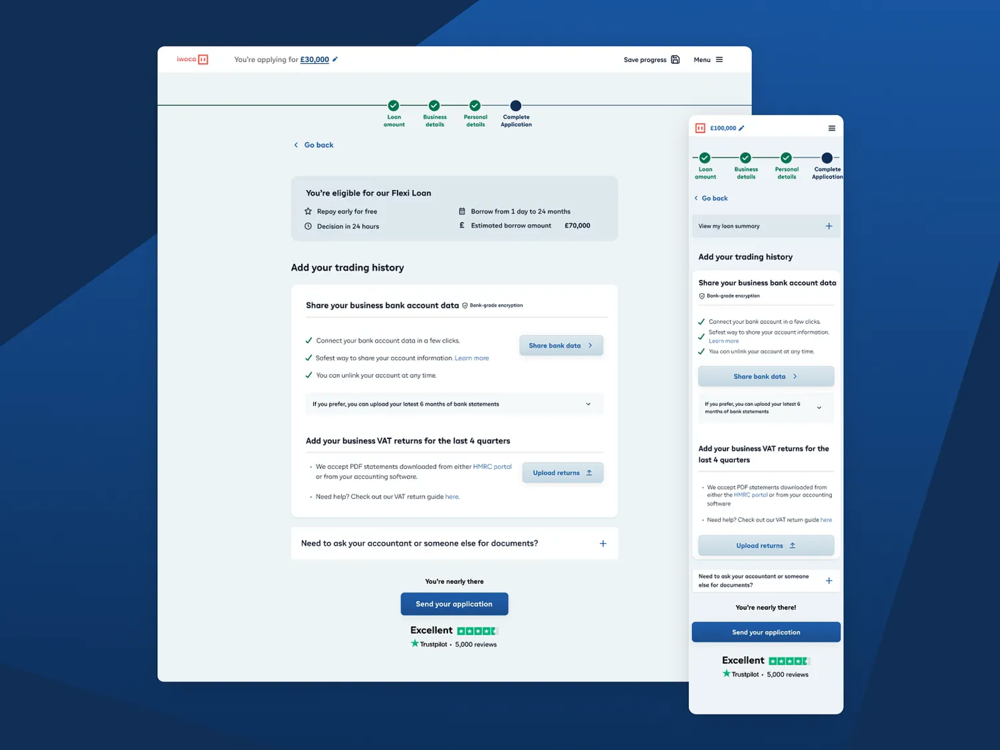
*[View in Figma](https://www.figma.com/design/9VEkjGMBgUoiZxYAtDmqhi/Untitled?node-id=3-28)*

Desktop + mobile views side by side on a dark navy background. The application step is about data submission, not just form filling.

- **4-step progress indicator** always visible at top: Loan amount ✓ · Business details ✓ · Personal details ✓ · **Complete Application** (current, filled circle) — gives the merchant a clear map of where they are
- **Eligibility confirmation banner** at top of content: "You're eligible for our Flexi Loan · Repay early for free · Decision in 24 hours · Borrow from 1 day to 24 months · Estimated borrow amount £70,000" — restates the offer at the moment of effort
- **"Share your business bank account data"** section (Bank-grade encryption badge):
  - ✓ Connect your bank account in a few clicks
  - ✓ Safest way to share your account information. Learn more
  - ✓ You can unlink your account at any time
  - "Share bank data →" CTA (primary)
  - Escape hatch: "If you prefer, you can upload your latest 6 months of bank statements ▾"
- **"Add your business VAT returns for the last 4 quarters":**
  - Accepts PDF from HMRC portal or accounting software
  - "Upload returns ↑" CTA (secondary)
- **"Need to ask your accountant or someone else for documents?"** — expandable accordion, acknowledges that business owners don't always have documents to hand
- Footer: "You're nearly there" → "Send your application" (dark navy, full-width CTA)
- **Trustpilot "Excellent ★★★★★ · 5,000 reviews"** placed directly below the submit button — the final trust signal before committing

Design observations:
- Dual input options for every data request (open banking OR upload) — reduces drop-off for merchants who can't or won't use open banking
- The "accountant" accordion is remarkably empathetic — acknowledges a real-world friction point without making it a blocker
- Trustpilot placement below submit CTA is high leverage — the most anxious moment of the flow gets the strongest social proof
- Mobile parity is clearly a design requirement — both views are shown simultaneously and match exactly

**Additional design references:** [Iwoca on Dribbble](https://dribbble.com/iwoca)

**Strength vs Uncapped in UK:** FCA-regulated, profitable, well-trusted SME brand in UK.
**Weakness:** UK only, no Amazon/marketplace-specific angle, no multi-product suite.

---

### 7. PayPal Working Capital

**Model:** MCA
**Geography:** US-focused
**Pricing:** Custom fixed fee based on PayPal processing volume

**Figma benchmark:** [Other section](https://www.figma.com/design/9VEkjGMBgUoiZxYAtDmqhi/Untitled?node-id=3-29)

**Screen 1 — "Sample Fee Calculator" (pre-application)**

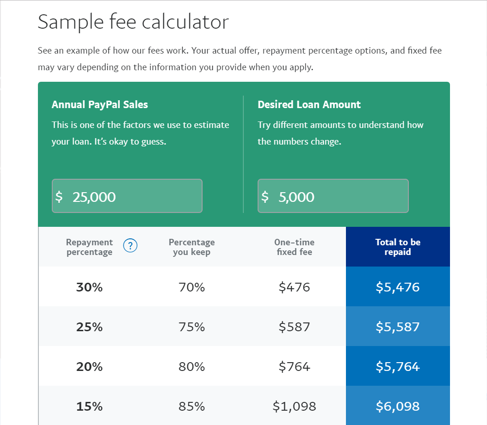

"Sample fee calculator." Two inputs in a green header: Annual PayPal Sales ($25,000) / Desired Loan Amount ($5,000). Intro copy: *"It's okay to guess."* Comparison table with **four** repayment percentage options: 30% → 70% kept → $476 fee → **$5,476 total** · 25% → 75% → $587 → **$5,587** · 20% → 80% → $764 → **$5,764** · 15% → 85% → $1,098 → **$6,098**. "Total to be repaid" column highlighted in dark blue gradient. All four options visible at once — merchant chooses based on how much of their daily revenue they want to dedicate to repayment.

Design observations:
- "Sample fee calculator" framing (not "apply") — this is an education tool shown before any commitment
- Four rows side-by-side makes the repayment speed vs fee tradeoff visual and concrete
- Lower repayment percentage = lower daily cash impact but higher total fee — the table makes this counterintuitive relationship clear
- "It's okay to guess" is the most user-friendly copy in the category at the input stage

**Screen 2 — "At a Glance" Repayment Widget**

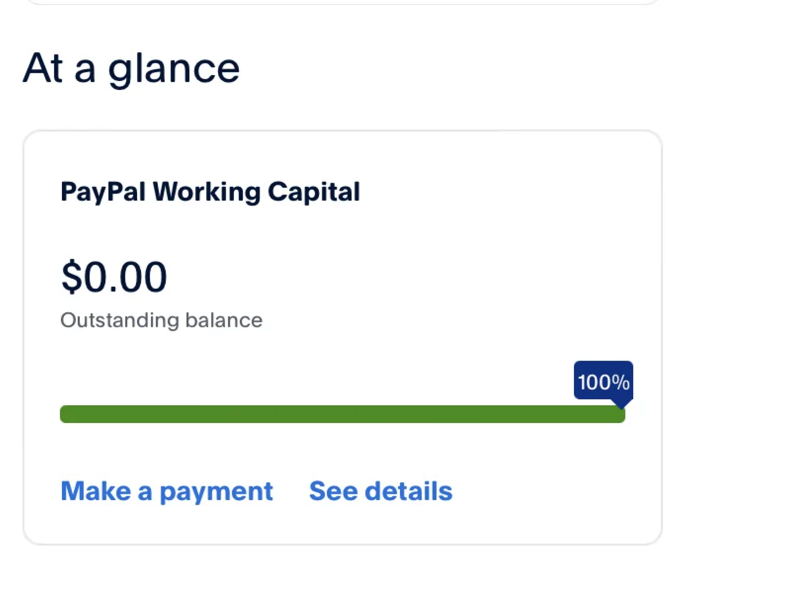
*[View in Figma](https://www.figma.com/design/9VEkjGMBgUoiZxYAtDmqhi/Untitled?node-id=3-32)*

Minimal embedded card within the PayPal merchant dashboard: "$0.00 Outstanding balance", green progress bar at 100% with tooltip "100%", two text links "Make a payment / See details". Extremely low information density — just the current state and two actions. This is the ongoing experience after funding.

**UX pattern:** Offer visible directly inside PayPal merchant dashboard. Repayment auto-deducted from PayPal transactions. No separate bank connection needed.

---

### 8. Amazon Lending / Amazon Capital

**Model:** Multi-lender marketplace (Amazon acts as distributor; Parafin/Slope are actual lenders)
**Geography:** US-focused, up to $5M
**UX pattern:** Offer appears inside Seller Central. Sellers apply without leaving Amazon.

---

### 9. YouLend (UK)

**Model:** Embedded revenue-based financing
**Geography:** UK primary
**Pricing:** Claims 20% below market
**Distribution:** QuickBooks integration, Ebury, payment providers

---

### 10. Onramp Funds

**Model:** Revenue-based financing
**Geography:** US-focused
**Pricing:** 2–8% fee + % of daily sales
**Distribution:** Multi-platform (Amazon, Shopify, Walmart) — closest to Uncapped's multi-platform angle

---

### 11. Stripe Capital

**Model:** MCA / revenue-based financing embedded in Stripe Dashboard
**Geography:** US, UK (GBP offers confirmed in benchmark)
**Distribution:** Stripe merchants only — offer visible in Stripe Dashboard

**Screen 1 — Offer Selection**

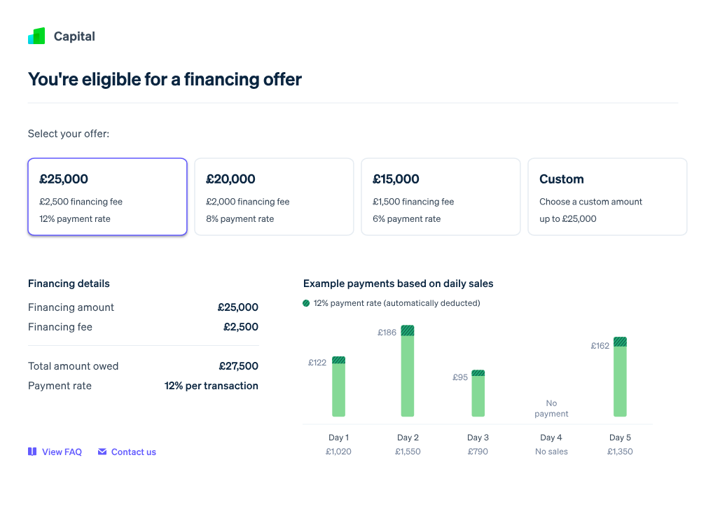

"You're eligible for a financing offer." Four pre-set offer tiles in a 2×2 grid: **£25,000** (£2,500 fee, 12% payment rate) · **£20,000** (£2,000 fee, 8%) · **£15,000** (£1,500 fee, 6%) · **Custom** (up to £25,000). Below the tiles: "Financing details" table — financing amount, financing fee, total amount owed, payment rate — all updating to match the selected tile. Alongside: bar chart "Example payments based on daily sales" showing what 12% deductions would look like per day (Day 1 £122, Day 2 £186, Day 3 £95, Day 4 No payment, Day 5 £162).

Design observations:
- Pre-set tiers + custom option: the most structured offer selection UI in the category. Tiers reduce decision paralysis; Custom gives power users control
- Bar chart showing daily payment variability is the clearest explanation of revenue-based repayment in any competitor — makes "it goes up and down with your sales" visual and concrete
- Fee + total owed displayed for the selected tier immediately — no click-through to see cost

**Screen 2 — Custom Amount Slider**

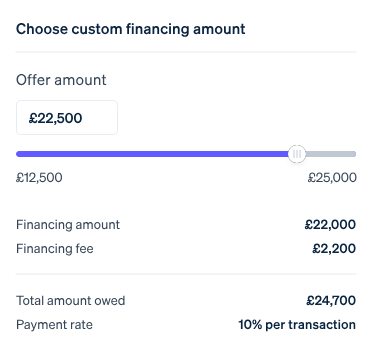

"Choose custom financing amount." Offer amount field (£22,500) + horizontal slider (£12,500–£25,000). Fee details update live: financing amount £22,000, financing fee £2,200, total owed £24,700, payment rate 10% per transaction.

Design observations:
- Live-updating fee breakdown as the slider moves = the most transparent pricing UX in the category
- Range displayed on slider (min/max) sets expectations before touching the control

**Screen 3 — Amount Selection Modal (US, larger offer)**

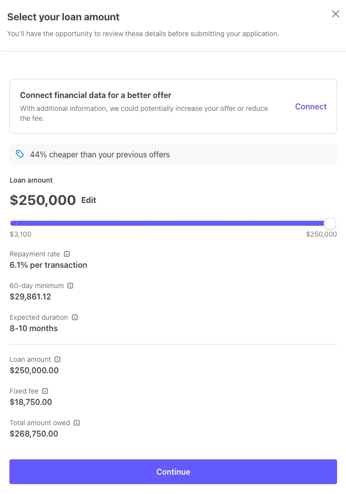

Modal overlay. "Select your loan amount." "Connect financial data for a better offer" prompt (banner at top — optional upgrade path). "44% cheaper than your previous offers" badge — comparison to the merchant's own history builds urgency and trust. Loan amount $250,000 with slider ($3,100–$250,000) + "Edit" text link. Live breakdown: repayment rate 6.1% per transaction · 60-day minimum $29,861.12 · expected duration 8–10 months · loan amount $250,000 · fixed fee $18,750 · total owed $268,750. "Continue" full-width CTA.

Design observations:
- "44% cheaper than your previous offers" is a uniquely powerful personalised anchor — only possible because Stripe has historical offer data
- "Expected duration 8–10 months" sets timeline expectations without committing to a fixed date
- 60-day minimum payment shown explicitly — no hidden minimum repayment obligation

**Strength vs Uncapped:** Stripe merchants get offers with zero application, fully embedded. Real-time fee calculator is the best in category.
**Weakness:** Stripe merchants only. No UK line of credit. No multi-platform.

---

### 12. Square Capital / Square Loans

**Model:** Term loan (not MCA — fixed regular payments)
**Geography:** US
**Distribution:** Square merchants only

**Screen — Loan Repayment Dashboard**

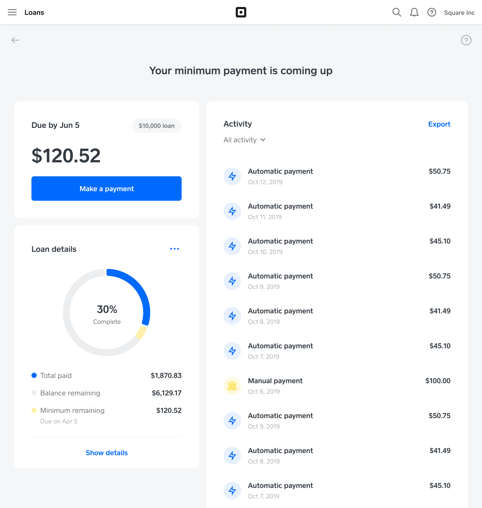

"Loans" header (Square icon). "Your minimum payment is coming up." Left panel: Due by Jun 5 ($10,000 loan) — **$120.52 due**, "Make a payment" button (blue). Loan details: donut chart **30% complete**, total paid $1,870.83, balance remaining $6,129.17, minimum remaining $120.52. Right panel: Activity feed — automatic payments ($50.75, $41.49, $45.10 etc.) and one manual payment ($100).

Design observations:
- Clean two-panel layout: action on the left (what to do now), history on the right (what happened)
- Donut chart for loan progress is immediately scannable — 30% complete is clearer than a number
- "Your minimum payment is coming up" as the page headline is a gentle nudge, not an alarm
- Activity feed with automatic vs manual payment differentiation gives merchants full visibility
- No Stripe/Shopify sophistication here — simpler product, simpler UI. Appropriate for Square's SME base

**Strength vs Uncapped:** Deeply embedded in Square POS ecosystem, automatic payments from Square revenue.
**Weakness:** US only, Square merchants only, simpler product (term loan only, no flexibility).

---

### 13. 8Fig

**Model:** Supply chain financing / inventory funding with structured "growth plan" cycles
**Geography:** US-focused
**Niche:** Amazon and e-commerce sellers with inventory-heavy supply chains

**Screen — Growth Plan Portal**

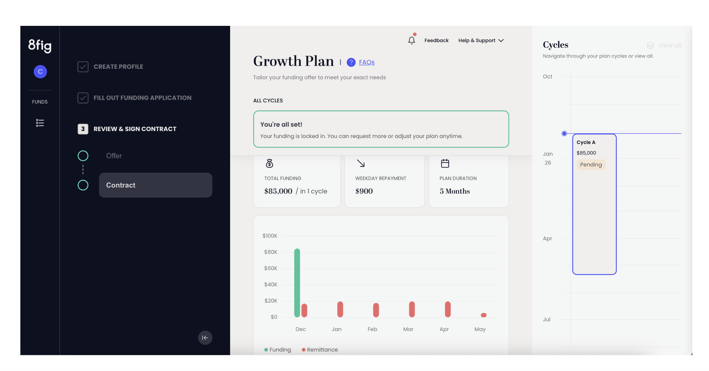

Dark left sidebar (near-black): 8fig logo, 3-step onboarding progress (CREATE PROFILE ✓ · FILL OUT FUNDING APPLICATION ✓ · REVIEW & SIGN CONTRACT active with sub-steps Offer and Contract). Main area: "Growth Plan | FAQs". "Tailor your funding offer to meet your exact needs." ALL CYCLES section with a green success card: "You're all set! Your funding is locked in. You can request more or adjust your plan anytime." Three KPI chips: Total funding $85,000 / in 1 cycle · Weekday repayment $900 · Plan duration 5 months. Bar chart (green = Funding disbursements, red = Remittance payments) across Dec–May. Right column: "Cycles" panel showing Cycle A ($85,000, Jan 26, status Pending).

Design observations:
- Dark UI is unique in the lending category — signals "serious platform for serious sellers"
- Cycle-based funding model is visually explained with the Funding/Remittance bar chart — green bars are capital in, red bars are repayments out. Clear and honest
- Onboarding progress tracker in the sidebar makes the 3-step process feel manageable
- "You can request more or adjust your plan anytime" in the success card — sets expectations for ongoing relationship, not one-shot transaction
- The cycle / calendar model is 8Fig's core differentiator — funding timed to inventory purchase cycles, not sales performance

**Strength vs Uncapped:** Purpose-built for inventory cycles (Amazon FBA, seasonal sellers). Structured drawdown schedule matches cash flow needs.
**Weakness:** Very niche — only works for inventory-heavy merchants. High complexity UX. Not a general e-commerce lending product.

---

## Positioning Matrix

| Dimension | Uncapped | Wayflyer | Slope | Parafin | Clearco | Iwoca |
|---|---|---|---|---|---|---|
| **Primary message** | Simple, fair working capital | 24-hour speed | AI credit infrastructure | White-label platform capital | Flexible DTC funding | Fast UK SME loans |
| **Target buyer** | E-commerce sellers ($10K+/mo) | DTC founders ($20K+/mo) | Platforms + large sellers ($100K+/yr) | Platform operators | DTC brands ($100K+/mo) | UK SMEs |
| **Products** | Term Loan + LoC + Cash Advance + Daily Payout | Cash Advance + Term + Rolling + Wholesale | Amazon LoC + Embedded | Capital + Spend Card + BNPL | Fixed + Rolling + Invoice | Flexi-Loan + BNPL |
| **Distribution** | Direct + Amazon + API | Direct-to-merchant | Platform-embedded (B2B) | B2B2C infrastructure | Direct-to-DTC | Direct (UK) |
| **Geography** | US + UK | US + UK | US only | US only | US | UK only |
| **Trustpilot** | — | 4.9/5 ⭐ | N/A | N/A | Mixed | — |
| **Min. revenue** | $10K/mo | $20K/mo | $100K/yr | Via platform | $100K/mo | No stated minimum |

---

## UX / UI Patterns Summary

### Common patterns across the category

| Pattern | Who uses it | Notes |
|---|---|---|
| Pre-approved offer widget | Shopify Capital, Parafin, Slope, Amazon | Highest conversion — no application anxiety |
| Revenue slider for amount selection | Parafin, Clearco, Wayflyer | Removes blank-field anxiety |
| 3–4 step "How it works" on homepage | All direct lenders | Trust-building, reduces cognitive load |
| Read-only platform data connection | Wayflyer, Clearco | OAuth-style flow — 10 min typical |
| Automatic revenue-based repayment | All | Expected in category, not differentiating |
| Funding calculator on homepage | Wayflyer | No competitor offers interactive calc — opportunity |
| Trustpilot score in hero | Wayflyer | Strong social proof for direct acquisition |
| Named case studies | Clearco (DTC logos), Wayflyer | Uncapped gap — no named case studies |

### Patterns Uncapped is missing

| Gap | Competitor who does it | Priority |
|---|---|---|
| Interactive funding calculator | Wayflyer (basic), nobody (interactive) | High — unique opportunity |
| Named merchant case studies with results | Wayflyer (implied), Clearco (logos) | High — trust-building |
| "X vs Uncapped" comparison pages | Clearco has FAQ version | High — high-intent SEO |
| Marketing analytics in dashboard | Wayflyer (unique differentiator) | Medium |
| Pre-approved offer widget (API) | Parafin, Slope, Shopify | Medium — requires partner investment |
| Video testimonials | Nobody does well | Medium |
| Podcast / content series | Nobody | Low — first-mover opportunity |

---

## Improvement Plan — What to Research Next

This document gives a solid first-pass competitive picture. Below is a phased plan to deepen it.

### Phase 1 — Screen Capture (immediate)

Capture real UI flows from each competitor's public-facing product:

- [ ] **Wayflyer** — record full application flow (create test account or use demo). Capture: homepage → eligibility check → data connection → offer screen → dashboard
- [ ] **Clearco** — same: get-funded flow, structure selection step, offer screen
- [ ] **Iwoca** — UK application flow, calculator, open banking screen
- [ ] **Shopify Capital** — document the Seller admin widget pattern (screenshots or Shopify help docs)
- [ ] **Parafin** — review published partner dashboard screenshots from brand refresh post

**Tools:**
- [PageFlows](https://pageflows.com) — check for all four primary competitors
- [Mobbin](https://mobbin.com) — search Wayflyer, Clearco, Iwoca for any captured flows
- [Screenlane](https://screenlane.com) — fintech category filter
- Use Loom to record flows from competitor demo accounts

### Phase 2 — UX Flow Mapping

For each competitor, map the full user journey as a flow diagram:

1. **Acquisition:** Ad / organic → landing page → CTA
2. **Onboarding:** Eligibility → account creation → data connection
3. **Offer:** Offer presentation → customisation → accept
4. **Funding:** Funds delivery → confirmation → dashboard first view
5. **Ongoing:** Repayment tracking → re-apply / top-up

**Specific flows to prioritise:**
- Wayflyer data connection (which integrations, in what order, UX of OAuth)
- Clearco "choose your structure" step (Fixed vs Rolling decision)
- Iwoca open banking integration (UK-specific, relevant for Uncapped UK)
- Slope/Parafin: pre-approved widget pattern (partner integration model)

### Phase 3 — Messaging & Content Audit

Audit each competitor's website copy, blog, and SEO strategy:

- [ ] Homepage headline + subheadline + hero CTA
- [ ] Product naming conventions
- [ ] Pricing page transparency (or lack of it)
- [ ] SEO keywords they rank for (use Ahrefs / Semrush)
- [ ] Blog topics and publishing cadence
- [ ] Trustpilot / G2 review themes (what customers praise, what they complain about)

**SEO opportunities for Uncapped (not owned by competitors):**
- "Working capital for Amazon sellers UK"
- "E-commerce line of credit"
- "Wayflyer alternative UK"
- "Alternative to Shopify Capital"
- "No personal guarantee e-commerce loan"

### Phase 4 — Design System Benchmarking

For each competitor, document their design language as it relates to Uncapped's UI kit:

| Competitor | Fonts | Primary colour | Border radius style | Shadow style | Notes |
|---|---|---|---|---|---|
| Wayflyer | TBD | Dark navy + teal | Rounded | Medium | Investigate |
| Clearco | TBD | Purple/violet | Large (friendly) | Soft | TBD |
| Parafin | Inter + Inter Tight | Green (#1 primary) | Medium | Clean | Confirmed from brand refresh |
| Iwoca | TBD | Blue/teal | Medium | Clean | Dribbble shots available |

**Goal:** Identify where Uncapped's visual identity has an opportunity to stand apart — or where it's currently too close to a competitor.

### Phase 5 — Qualitative Review Mining

Read 50–100 Trustpilot and G2 reviews per competitor to identify:
- What do merchants praise? (maps to what matters most)
- What do they complain about? (maps to unmet needs = Uncapped opportunities)
- Which competitor has the weakest reviews in a category Uncapped is strong at?

**Starting point:** Wayflyer Trustpilot has 92% five-star — read the 6% negative reviews specifically. Those are the gaps.

---

## Key Opportunities for Uncapped

Based on this analysis, three are the highest-leverage areas:

### 1. Multiproduct breadth — no competitor matches it
Only Uncapped offers Term Loan + Line of Credit + Cash Advance + Daily Payout together. This is a genuine differentiator but currently underplayed in messaging and UI. The dashboard should make multi-product access obvious.

### 2. Underwriting transparency — Wayflyer's one exploitable weakness
Wayflyer's 6% negative reviews cite opacity in underwriting decisions. Uncapped can own "we explain our offer" as a trust signal — clear offer breakdown, explanation of variables considered, personalised account manager contact.

### 3. UK market — defensible position against US-only competitors
Slope (US only), Parafin (US only), Clearco (US-focused). Iwoca owns UK SMEs but lacks Amazon/marketplace angle. Uncapped is positioned to own "UK e-commerce seller financing" if invested in with specific content and product.

---

## Sources

- Internal: Uncapped Competitive Brief, April 10, 2026 (Confidential – Tier 3)
- [Wayflyer](https://wayflyer.com) · [Press Room](https://wayflyer.com/en/press-room)
- [Wayflyer Dashboard — Dribbble](https://dribbble.com/shots/19769121-Wayflyer-Insights-Dashboard-V2)
- [Wayflyer Mobile Dashboard — Dribbble](https://dribbble.com/shots/19456590-Wayflyer-Mobile-Dashboard)
- [Clearco](https://clear.co) · [Ecommerce Funding](https://www.clear.co/ecommerce-funding)
- [Parafin](https://parafin.com) · [Brand Refresh Article](https://www.parafin.com/blog/designing-for-growth-inside-parafins-brand-refresh)
- [Iwoca](https://iwoca.co.uk) · [Iwoca on Dribbble](https://dribbble.com/iwoca)
- [Shopify Capital changelog](https://changelog.shopify.com/)
- [PageFlows — Wayflyer](https://pageflows.com/wayflyer/)
- [Credilinq — 2025 Wayflyer Review](https://credilinq.ai/blogs/wayflyer-alternatives-competitors/)
- [Tracxn — Clearco](https://tracxn.com/d/companies/clearco/__k6Fg0qTRN3dg0Rm1WXcotjnENTAUFonJi85nytZUqhw)
